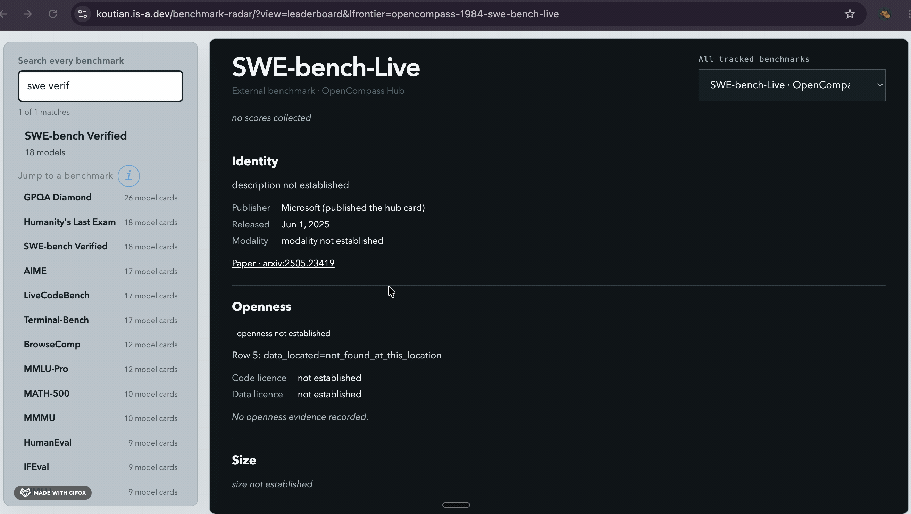
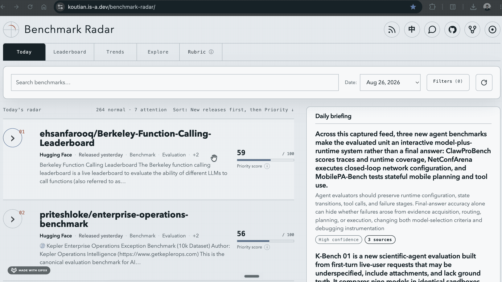
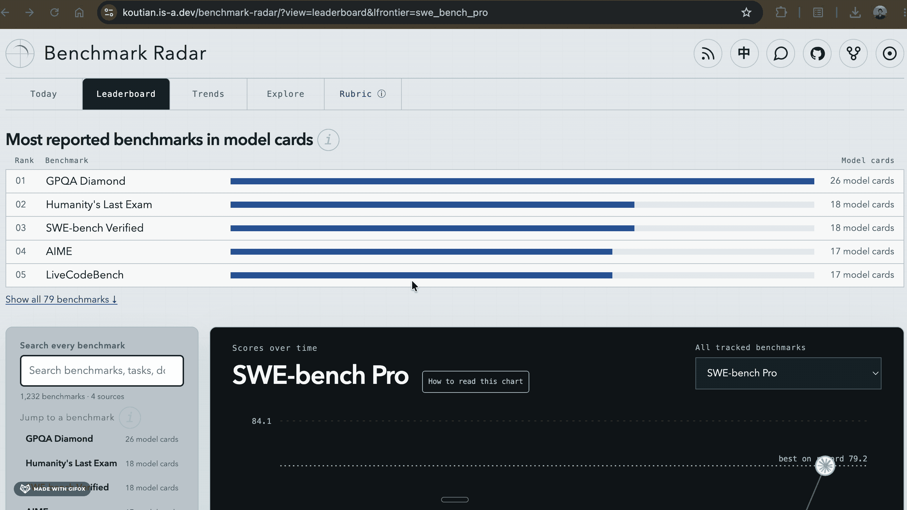
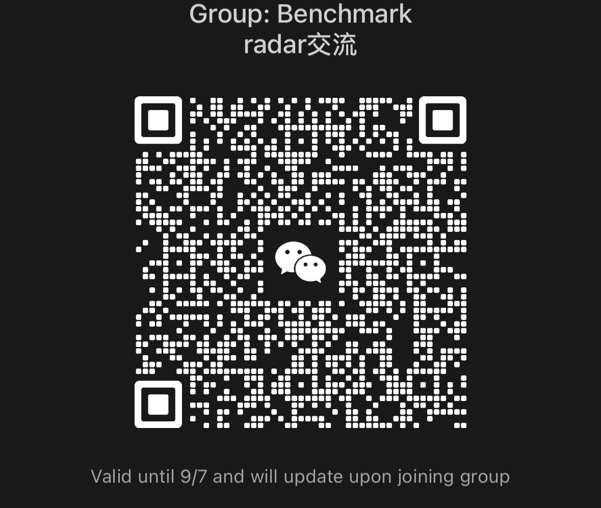

<div align="left">

[中文](README.zh-CN.md)

</div>

# Benchmark Radar

<!-- The record-count badge is data-driven: it is regenerated from the corpus on
every collection, so it states what the project actually holds rather than a
hand-edited number (issue #197). -->

<p align="center">
  <a href="https://benchmark-radar.org/"></a>
  <a href="https://benchmark-radar.org/data/radar.json"></a>
  <a href="https://x.com/ktwu01"></a>
  <a href="https://www.linkedin.com/in/ktwu01"></a>
  <a href="https://scholar.google.com/citations?user=s9w1k-cAAAAJ&amp;hl=en"></a>
</p>

I kept running into new benchmarks while doing benchmark research, so I built a
crawler that continuously collects benchmark-related signals from across the
web. It pulls evidence from arXiv, GitHub, Hugging Face, OpenAlex, OpenReview,
first-party lab feeds, Brave Search, Semantic Scholar, Hacker News, and more
every day, and keeps updating.

**Find a benchmark in seconds, then see how model scores change over time. Click
the GIF below to watch SWE-bench Verified move toward saturation.**

<a href="https://benchmark-radar.org/?view=leaderboard&lfrontier=swe_bench_verified">
  
</a>

## See the dashboard

**Today: everything that showed up in the last 24 hours, scored and ranked, plus
a short daily briefing that says what changed and links the evidence it used.**

<a href="https://benchmark-radar.org/">
  
</a>

**Leaderboard: which benchmarks labs actually report in their model cards, and
how scores on each one climb until there is almost no headroom left.**

<a href="https://benchmark-radar.org/?view=leaderboard">
  
</a>

## Use it

- **[Open the dashboard](https://benchmark-radar.org/)** — today's insights, trends, popular benchmarks, model-card adoption, and more
- **[Subscribe via RSS](https://benchmark-radar.org/feed.xml)** — get new benchmark signals every day
- **[Download the complete dataset](https://benchmark-radar.org/data/radar.json)** — free, public, machine-readable JSON; no crawler or contact required
- **[Contribute](CONTRIBUTING.md)** — add benchmarks, model cards, sources, or fixes

If Benchmark Radar saves you research time, **[star the repository](https://github.com/ktwu01/benchmark-radar)**. It helps other eval builders find it.

## Query it locally

The CLI downloads a complete, verified copy of the data shown by Benchmark Radar,
then searches it locally. Until a packaged release is published, install it directly
from GitHub, then initialize it once:

```bash
python -m pip install 'git+https://github.com/ktwu01/benchmark-radar.git'
benchmark-radar init
benchmark-radar search "long-horizon agent benchmark" --scope all --json
benchmark-radar show opencompass-1248-mmmu --json
benchmark-radar recent --recommended --json
benchmark-radar status --json
```

`init` stores the current catalog, detail records, and Radar snapshots under
`~/.benchmark-radar` on macOS/Linux or the current user's `.benchmark-radar`
directory on Windows. Set `BENCHMARK_RADAR_HOME` or pass `--data-dir` to choose
another location. Update it explicitly before a new research session:

```bash
benchmark-radar sync
```

`sync` first checks the small published manifest. It downloads only when the data
version changed, verifies the archive size and SHA-256 checksum, validates the
catalog and snapshots, switches versions atomically, then removes the previous
version. A failed activation leaves the last verified version active. If the OS
temporarily locks an obsolete directory, sync reports `cleanup_pending` and retries
that physical cleanup next time; only the new version remains queryable. Search
itself never accesses the network or silently changes data, so its reported
`data_version` is reproducible. A Benchmark Radar Skill should run `sync --json`
once at the start of benchmark research, then use `search --json` and `show --json`;
`--json` selects the stable machine-readable output, while the default output is
for people.

Agents can install the optional, purpose-neutral CLI guide from this repository:

```bash
npx skills add ktwu01/benchmark-radar --skill benchmark-radar
```

The Skill chooses among the CLI commands from the user's request; it does not assume
whether the results are for research, evaluation design, model selection, or another
workflow.

`catalog` searches the normalized benchmark catalog, `radar` searches the daily
evidence history, and `all` searches both while keeping their identities separate.
Search is deterministic lexical/token matching in this version—not embedding-based
semantic search—and every result explains its matched fields, token coverage, and
ranking reason. Filters include paper, repository, dataset, openness, modality, and
source.

The optional local HTTP API uses exactly the same query service and JSON response
contract:

```bash
benchmark-radar serve --host 127.0.0.1 --port 8765
curl 'http://127.0.0.1:8765/api/v1/search?q=agent%20benchmark&scope=all'
```

Available read-only routes are `GET /api/v1/search`,
`GET /api/v1/benchmarks/<key-or-slug>`, `GET /api/v1/recent`,
`GET /api/v1/status`, and `GET /healthz`. Both interfaces read generated catalog
files from the managed data directory; they do not fetch the network during a query.
This is a local server, not a publicly deployed search API. MCP and semantic
retrieval can be added later without creating a second ranking implementation.

`benchmark-radar normalize-external` and `benchmark-radar build-data-release` are
maintainer/CI build commands. End users update with `sync`, not with the normalizer.

## More

- **SEO and indexing:** [`docs/seo-indexing-guide.md`](docs/seo-indexing-guide.md)
- **Scoring rubric:** [`src/benchmark_radar/rubric.py`](src/benchmark_radar/rubric.py)
- **Model-card adoption data:** [`data/model_cards.yml`](data/model_cards.yml)
- **Public corpus schema:** [`docs/cumulative-corpus.schema.json`](docs/cumulative-corpus.schema.json)
- **Citation metadata:** [`CITATION.cff`](CITATION.cff)
- **Configuration:** [`config.yml`](config.yml)
- **Developer setup:** `python -m pip install -e '.[dev]' && benchmark-radar normalize-external`
- **Support / bugs:** [open an issue](https://github.com/ktwu01/benchmark-radar/issues)
- **Contact:** [@ktwu01](https://github.com/ktwu01)
- **License:** MIT

## Join the WeChat group

Scan the QR code to join the WeChat group for daily benchmark updates and eval discussions:



## Acknowledgements

The frontier-model score layer, including the SWE-bench Verified timeline above,
is built on benchmark data collected by [LLM Stats](https://llm-stats.com).
Thank you for keeping that data open.

## Citation

If Benchmark Radar supports your research or evaluation work, please cite it:

```bibtex
@misc{wu2026benchmarkradar,
  title        = {Benchmark Radar: A Daily, Evidence-First Radar and Machine-Readable Corpus for AI Benchmarks},
  author       = {Wu, Koutian},
  year         = {2026},
  howpublished = {\url{https://github.com/ktwu01/benchmark-radar}},
  note         = {Daily benchmark radar and open dataset}
}
```

See [`CITATION.cff`](CITATION.cff) for machine-readable citation metadata.

## Star History

<a href="https://www.star-history.com/#ktwu01/benchmark-radar&Date">
  <picture>
    <source media="(prefers-color-scheme: dark)" srcset="https://raw.githubusercontent.com/ktwu01/benchmark-radar/star-history/assets/star-history-dark.svg" />
    
  </picture>
</a>
